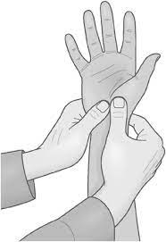

# Karpal Tünel Sendromu {#KTSTanim}

Karpal tünel sendromu, medyan sinirin karpal tüneli içerisinde baskıya uğraması sonucu ortaya çıkan semptomların genel adıdır [@werner2002carpal].  
Tarihte ilk kez Pajet tarafından, 1854 yılında medyan sinir hasarının bulguları gözlenirken tanımlanmıştır [@history1988].  
Karpal tünel sendromu, tanımlanması ve terimleştirilmesi ilk olarak 1947 yılında Brain, Wright ve Wilkinson tarafından yapılmıştır [@1995love].
```{r echo=FALSE,fig.align="center", fig.cap="Karpal Tünel Anatomisi ve Medyan Sinirin Sıkışması"}
knitr::include_graphics(path = "figure/karpal_tunnel.png")
```

## Epidemiyoloji {#KTSEpidemiyoloji}  

KTS prevalansı kadınlarda %3 ila %3.4 arasında, erkeklerde ise %0.6 ila % 2.7 arasında olarak
belirlenmiştir. İnsidans ise kadınlarda 100.000’de 140, erkeklerde 100.000’de 52 olarak saptanmıştır.
Kadınlarda genellikle menopoz dönemimde sıklıkla görülmüş olsa da hem erkek hem de kadınlarda
gözlenme sıklığı yaş ile doğru orantılıdır [@kts_mustafa]. KTS’nin %40 ila %60 oranında her iki elde de başlayabileceği çeşitli yayınlarda bildirilmiş olup, iki elde de görüldüğü olgularda baskın elin genellikle semptomları daha önce ve daha şiddetli gösterdiği söylenebilir. KTS tek elde görüldüğü durumlarda ise genellikle semptomlar baskın elde görülür [@kts_bagatur].  

## Etiyoloji {#KTSEtiyoloji}  

KTS'nin en sık nedeni; herhangi bir etiyolojik etkenin saptanamadığı idiopatik KTS’dir. İdiopatik KTS’de ailesel yatkınlık, obezite, VKİ fazla olması, kare şeklinde bilek yapısı gibi
kişisel faktörlerin etken olduğu düşünülmektedir. Günlük yaşamdaki mekanik etkenler de idiopatik KTS
üzerinde etkin rol oynamaktadır. Montaj işinde çalışan işçiler, fabrika çalışanları, klavye ve bilgisayar
kullananlarda olduğu gibi el bilek fleksiyonunun aktif olarak yapıldığı belli hareketlerin çok sık
tekrarlanması da KTS ile ilişkili bulunmuştur [@robbins1963anatomical].  

## Semptomlar {#KTSSemptom}  

Hastalığın şiddetine bağlı olarak semptomlar değişkendir. Erken evrelerde medyan sinirin duyusal
liflerinin tutulumuna bağlı şikayetler görülür. En yaygın semptom el bileğinin merkezinden uzak
dokularda sızlama ve uyuşuklukla beraber yanıcı tarzda ağrıdır. Başparmak tarafından itibaren ilk üç
parmak ve dördüncü parmağın yanal yarısı etkilenir. Daha ileri dönemlerde el ayasında kas
güçsüzlüğü ve körelme meydana gelir. Bu hastalarda elde, özellikle aktivite ile artan beceriksizlik ve objeleri kavramada kuvvetsizlik görülür [@aroori77carpal].  

## Tanı ve Ciddiyet Değerlendirmesi {#KTSTani_Ciddi}  

KTS'de tanı koymak için hastanın hikayesi, klinik semptomlar, fizik muayene bulguları ve bu bulguları destekleyen çeşitli testler kullanılmaktadır[@ghasemi2014handy].
Bu testler elektronörofizyolojik, provokatif testler ve tıbbi görüntülemeye dayanan testlerdir.
Elektronörofizyolojik testler karpal Tünel'e bağlanan elektrotlar ile elektrik sinyallerinin incelenmesi ve sonuçların bilgisayar ile yorumlanmasına dayananan testlerdir.
(ref:noropati) [@kumacs2005idiyopatik]
```{r echo=FALSE,fig.align='center',fig.cap="Elektronörofizyolojik Test (ref:noropati)",out.width="49%",out.height="18%"}
knitr::include_graphics(path="figure/noropati_test.jpg")
```  
Provokatif testler hastanın bilek ve parmak eklemlerine fiziksel baskı uygulayacak şekilde birtakım
testler uygulanması ve alınan sonuçların değerlendirmesine dayanan deneysel test yöntemleridir.
Tanısal testler genellikle karpal tüneli görüntülemeye dayanan testlerdir.  

* Phalen Testi  

  + 60 saniye boyunca parmaklar ayak ucuna bakacak şekilde el dış yüzleri birleştirilir. Meydan sinir bölgesinde karıncalanma oluşur veya artarsa test pozitiftir.  

* Ters Phalen testi  

    + 60 saniye boyunca parmaklar yukarı bakacak şekilde el dış yüzleri birleştirilir. Meydan sinir bölgesinde karıncalanma oluşur veya artarsa test pozitiftir.  

* Tinel testi  

    + Uygulayıcı tarafından karpal tünelin üstüne perküsyon yapılır. Medyan sinir bölgesinde karıncalanma ve elektrik şoku hissi oluşursa test pozitiftir [@kurt2020karpal].  

* Karpal kompresyon testi  

    + El bileği düz tutulurken medyan sinirin yakınına başparmak ile bastırılır. Medyan sinir bölgesinde karıncalanma oluşur veya artarsa test pozitiftir.  

* Gerilmiş medyan sinir stres (GMSS) testi  

  + Medyan sinir hareketliliğinin azaldığı durumlarda medyan sinirin gerilerek lokal iskeminin arttırılması mantığına dayanır.  

```{r echo=FALSE, fig.align='center',fig.show='hold',fig.cap="Phalen ve Tinel Testi",out.width="49%",out.height="18%"}

knitr::include_graphics(path="figure/tinel.jpg")
```
```{r echo=FALSE, fig.align='center',fig.show='hold',fig.cap="Karpal Kompresyon ve GMSS Testi ",out.width="49%",out.height="18%"}

knitr::include_graphics(path="figure/gerilmis.png")
```  
Görüntülemeye dayalı testlerde el bileği ve parmakların hareketi sırasında karpal tünel içerisindeki değişiklikleri ve medyan sinirin hareketlerini yorumlayarak hastaya tanı koymayı kolaylaştırır fakat hastalığın şiddeti hakkında bilgi vermez.  

* Ultrasonografi  

* Düz radyografi  

* Bilgisayarlı tomografi  

* Manyetik rezonans görüntüleme  

```{r echo=FALSE, fig.align='center',fig.show='hold',fig.cap="Ultrasonografi ve Düz Radyografi ",out.width="49%",out.height="22%"}

knitr::include_graphics(path="figure/radyog.jpg")
```
```{r echo=FALSE, fig.align='center',fig.show='hold',fig.cap="Bilgisayarlı Tomografi ",out.width="49%",out.height="22%"}

```
İdiopatik KTS'de hastalığın tanımlanmasında Boston Karpal Tünel Sendromu
Anketi (BKTSA) kullanılmaktadır [@levine1993self]. Bu ankete farklı dillere çevrilmiş ve ülkelere göre uyarlanmıştır. Anketin amacı hastanın yanıtlarına göre bir ciddiyet sınıflandırması yapmaktır. Anketin Türkçe versiyonu Sezgin ve ark. [@sezgi2006assessment] tarafından yayımlanmıştır, ancak BKTSA sadece hastaların verdiği yanıtlara dayanarak bir semptom şiddeti belirlemeyi amaçlar.  

Teknolojinin hızla gelişmesi ile birlikte hastalara uygulanan testlerin sonuçlarının toplanmasının kolaylaşmasının yanı sıra testlerin sonuçlarına bağlı olarak hastaya tanı koymak ve tanının şiddetini ve derecesini tespit etmek oldukça kolaylaşmıştır.  
Makine öğrenmesi ve Yapay zeka uygulamalarının yaygınlaşması ile birlikte bu yöntemlerin tıp alanında da kullanımı artmıştır.  

Makine öğrenmesi yöntemlerinin KTS tanısında kullanılmasına örnek olarak.
Ardakani ve ark. [@ardakani2020diagnosis] tarafından hasta olduğu bilinen kişilerden elde edilen bilgisayarlı tomografi görüntüleri, derin öğrenme metotları kullanılarak başka kişilerin hasta olup olmadığını tespit etmek için kullanılmıştır.  
Bir diğer çalışma ise 2021 yılında Koyama ve ark. [@koyama2021screening] tarafından geliştirilen bir mobil uygulama sayesinde hastaların ekranın farklı yerlerinde çıkan cisimlere ulaşma sürelerini baz alarak hastalığın evresini tahminlemeyi amaçlamıştır. Bu uygulama hastanın kendi kendine ev ortamında hastalığına ön tanı koyabilmesi açısından yararlı olabilir.\
Bunların yanı sıra KTS ciddiyet skoru belirlemek için makine öğrenmesi yöntemlerini kullanan çalışmalar da yapılmaktadır.
Güncel bir çalışmada Park ve ark. [@park2021machine] 1037 hastadan elde edilen verileri farklı makine öğrenmesi yöntemlerinde kullanarak KTS ciddiyet sınıflandırmasını tahmin etmeyi amaçlamışlardır.