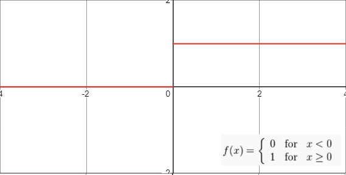

# Yöntem {#yontem}
Bu bölümde uygulama kısmında kullanılan sınıflama algoritmalarına değinilmiştir.    

## K - En Yakın Komşuluk Algoritması (K-NN) {#knn}
K-NN algoritması, Cover ve Hart tarafından önerilen, örnek veri noktasının bulunduğu sınıfın ve en yakın komşunun, k değerine göre belirlendiği bir sınıflandırma yöntemidir [@knn-info].  
K-NN algoritması, en temel örnek tabanlı öğrenme algoritmaları arasındadır. Örnek tabanlı öğrenme algoritmalarında, öğrenme işlemi eğitim setinde tutulan verilere dayalı olarak gerçekleştirilmektedir. Yeni karşılaşılan bir örnek, eğitim setinde yer alan örnekler ile arasındaki benzerliğe göre sınıflandırılmaktadır [@mlmcgraw]. K-NN algoritmasında, eğitim setinde yer alan örnekler n boyutlu sayısal nitelikler ile belirtilir. Her örnek n boyutlu uzayda bir noktayı temsil edecek biçimde tüm eğitim örnekleri n boyutlu bir örnek uzayında tutulur.  Bilinmeyen bir örnek ile karşılaşıldığında, eğitim setinden ilgili örneğe en yakın k tane örnek belirlenerek yeni örneğin sınıf etiketi, k en yakın komşusunun sınıf etiketlerinin çoğunluk oylamasına göre atanır [@mining2006data].  

### K-NN Parametleri
K-NN algoritmasında performansı etkileyen 3 adet hiper parametre mevcuttur. Bunlar; Uzaklık ölçütü, komşu sayısı(k) ve ağırlıklandırma yöntemidir.  

#### Uzaklık Ölçütü  
En bilinen ve yaygın olarak kullanılan 3 uzaklık;  

* Minkowski Uzaklığı  
* Öklid Uzaklığı  
* Manhattan Uzaklığı  

#### Komşu Sayısı (k)  
En yakın komşuluk algoritmasında komşu sayısına (k) göre sınıflama yapıldığından algoritma için en önemli parametresi olduğu söylenebilir. k = 5 olarak belirlendiğinde yeni gözlem kendisine en yakın 5 değer baz alınarak sınıflandırılır.  

#### Ağırlıklandırma  
Komşular için ağırlık değerleri atanması ile sınıflandırılmakta olan örneğe daha yakın olan komşu örneklerin, çoğunluk oylamasına daha fazla katkı koyması amaçlanır. En çok kullanılan ağırlık değeri atama yöntemleri, her bir komşunun ağırlığının, d, komşular arası uzaklık olmak üzere, 1/d ya da $1/d^2$ şeklinde alınmasıdır [@doad2013review].  

## Rassal Ormanlar {#random_forest}
Rassal ormanlar sınıflandırıcısı, her biri farklı girdi vektörlerinden oluşan ve her ağacın yalnızca bir sınıfa oy verdiği karar ağaçlarının kombinasyonudur [@breiman1991]. Rassal ormanlar sınıflandırması ağaç derinliğini büyütmek için her dalda rastgele değişkenleri içerir.  

Karar ağaçlarını modellemek, bir budama metodu ve nitelik seçme ölçütü seçmeyi gerektirir. Karar ağacının tüme varımı için kullanınlan bir sürü nitelik seçme yaklaşımı vardır ve çoğu yaklaşımlar niteliğe direkt olarak kalite ölçümü belirler. Karar ağacının tümevarımındaki en sık kullanılan nitelik seçme ölçümleri Information gain ratio kriteri ve Gini indexidir [@breimanclassification].  

Verilen herhangi bir eğitim verisi için gini index o verinin hangi sınıfa ait olduğu olasılığını hesaplar.  

$$\begin{aligned}
\sum \sum_{j \neq i}(f(C_{i}, T) /|T|)(f(C_{j}, T) /|T|)
\end{aligned}$$  

Bu denklemde $f(C_{i}, T) /|T|)$ seçilen gözlemin $C_{i}$ sınıfa ait olma olasılığıdır.

Her seferinde bir ağaç, değişkenlerin bir kombinasyonunu kullanarak yeni eğitim verisi üzerinde en büyük derinliğe kadar büyür. Son derinliğine ulaşmış bu ağaçlar budanmamıştır. Bu durum,  [@quinlan2014c4] veya diğer karar ağacı metotlarına göre rassal ormanlanların en büyük avantajıdır. Bazı durumlarda maliyet ve karmaşıklığı minimum yapabilmek için rassal ormanlar içerisindeki karar ağaçlarına budama yapılır. Budama parametresi olan 'ccp_alpha' değerinden daha küçük olan en büyük maliyet ve karmaşıklık değerini bulunana kadar karar ağacı budanır.  

Sonuç olarak, rastgele ağaçlar metodu, kullanıcının herhangi bir değer belirleyebildiği, N kadar büyüyecek karar ağaçları içerir. Yeni veri setini sınıflandırmak için, seçilen maksimum değişken sayısına göre veri setindeki rastgele olarak paylaştırılmış her gözlem, N kadar karar ağacının her biri tarafından sınıflandırılır. Bu durum için ormanlar en fazla oya sahip sınıfı seçer.  
(ref:rfex) [@tibco]
```{r echo=FALSE,fig.align='center',fig.cap="Rassal Ormanlar Model Örneği (ref:rfex)",out.width="100%",out.height="48%"}
knitr::include_graphics(path="figure/rf_example.jpeg")
```


## XGBoost {#xgboost}  
Bu bölümde XGboost algoritmasına ve XGBoost algoritmasının daha iyi anlaşabilmesi için XGBoost'un altyapısını oluşturan gradyan arttırma algoritmasına değinilmiştir.  

### Gradyan Arttırımı  
Gradyan artırma fikri, Leo Breiman'ın , artırmanın uygun bir maliyet fonksiyonu üzerinde bir optimizasyon algoritması olarak yorumlanabileceği gözleminden kaynaklanmıştır [@breiman1997arcing]. Açık regresyon gradyan artırma algoritmaları daha sonra Jerome H. Friedman [@greedy], tarafından Llew Mason, Jonathan Baxter, Peter Bartlett ve Marcus Frean'ın daha genel fonksiyonel gradyan artırma perspektifiyle eş zamanlı olarak geliştirildi [@mason1999boosting].  

Gradyan artırma, genellikle karar ağaçları gibi zayıf tahmin modelleri topluluğu şeklinde bir tahmin modeli üreten, regresyon, sınıflandırma ve diğer görevler için bir makine öğrenimi tekniğidir. Bir karar ağacı zayıf öğrenen ise, ortaya çıkan algoritmaya genellikle rastgele ormandan daha iyi performans gösteren gradyan destekli ağaçlar denir [@hastie_tibshirani_friedman_2009]. Modeli, diğer artırma yöntemlerinin yaptığı gibi aşamalı bir şekilde oluşturur ve keyfi bir türevlenebilir kayıp fonksiyonun optimizasyonuna izin vererek bunları genelleştirir.  
Gradyan Arttırımı Algoritması ;  

* Adım 1 : $\{(x_i,y_i)\}_{i=1}^n$ şeklinde veri ve türevlenebilir bir kayıp fonksiyonu $L(y_i,F(x))$ tanımlanır.  

* Adım 2 : $F_0(x) = \min\limits_{\gamma}\,\sum_{i=1}^{n}L(y_i,\gamma)$ $\gamma$ = Tahmin Değeri olacak şekilde başlangıç değeri ($F_0(x)$) minumum olacak şekilde türevlenip 0'a eşitlenir ve $F_0(x)$'in minumum değeri elde edilir.  

* Adım 3 :  

    + Adım 3.1 : m=1 $\to$ M'e kadar bir önceki tahmin değerine göre hatalar hesaplanır. (M burada sınıflandırma veya regresyon ağacı sayısıdır)
	$$r_{im} = -\left[\frac{\partial L(y_i,F(x_i)}{\partial F(x_i)}\right]_{F(x)=F_{m-1}(x)}\:\,i=1 \to n$$
	+ Adım 3.2 : $r_{im}$ değerlerine göre regresyon veya sınıflandırma ağacı eğitilir ve $R_{jm}$ terminal bölgeleri oluşturulur.  

	+ Adım 3.3 : Her bir yaprak için çıktı değeri hesaplanır.
	$$\gamma_{jm} = \min\limits_{\gamma}\,\sum_{x_i\in R_{ij}}L(y_i,F_{m-1}(x_i)+\gamma)$$
	Yine aynı şekilde kayıp fonksiyonunun türevi alınır ve değerler toplanıp sınıfa eşitlenir. Çıkan sayı yaprağın değeridir.  

	+ Adım 3.4 : Her gözlem için tahmin oluşturulur.
	$$F_m(x) = F_{m-1}(x) + \nu\sum_{j=1}^{J_m}\gamma_{jm}I(x\in R_{jm})$$
Formül incelendiğinde yeni ağacın tahmin değerinin önceki ağacın tahmin değeri + (öğrenme düzeyi $\times$ yeni ağacın değeri) olduğu görülmektedir.  

(ref:gboost) [@dikker2017master]
```{r echo=FALSE,fig.align='center',fig.cap="Gradyan Arttırma Çalışma Mantığı (ref:gboost)",out.width="100%",out.height="40%"}
knitr::include_graphics(path="figure/gb-dixit.png")
```

### XGBoost (Aşırı Gradyan Arttırımı)  


XGBoost, temeli gradyan arttırımı ve karar ağacı algoritmalarına dayanan bir makine gözetimli öğrenme tekniğidir.
XGBoost algoritmasının orijinal hali Friedman tarafından 2002 yılında geliştirilmiştir [@dikker2017master]. Sonrasında Washington Üniversitesi’nde iki araştırmacı olan Tianqi Chen ve Carlos Guestrin tarafından SIGKDD (Bilgi İşlem Makinalarının Bilgi Keşfi ve Veri Madenciliği Özel İlgi Grubu Derneği) 2016 konferansında makale olarak sunulmuştur ve makine öğrenme dünyasında çok popüler olmuştur [@chen2016xgboost].  

XGBoost, yüksek tahmin etme gücüne sahip olup, diğer algoritmalardan 10 kat daha hızlıdır. Ayrıca XGBoost, genel performansı iyileştiren ve aşırı uyum ya da aşırı öğrenmeyi azaltan bir dizi düzeltme işlemleri içermektedir [@yangin2019xgboost].   

Gradyan arttırımı, güçlü bir sınıflandırıcı oluşturmak için, bir dizi zayıf sınıflandırıcıyı arttırma ile birleştiren topluluk yöntemidir. Güçlü öğrenici, temel bir öğrenici ile başlayarak yinelemeli olarak eğitilmektedir. Hem gradyan arttırımı hem de XGBoost aynı prensibi izlemektedir. Aralarındaki temel farklar uygulama detaylarında yatmaktadır. XGBoost, farklı düzeltme teknikleri kullanarak, ağaçların karmaşıklığını kontrol ederek daha iyi bir performans elde etmeyi başarmaktadır [@salam2018evaluating].  

* Adım 1 : $\{(x_i,y_i)\}_{i=1}^n$ şeklinde veri ve türevlenebilir bir kayıp fonksiyonu $L(y_i,F(x))$ tanımlanır. XGBoost algoritması kayıp fonksiyonu olarak $$L(y_i,P_i) = -[y_{i}log(P_i)+(1-y_i)log(1-P_i)]$$ fonksiyonunu kullanır burada $P_i$ tahmin değerine eşittir.  

* Adım 2 : $F_0(x) = \min\limits_{\gamma}\,\sum_{i=1}^{n}L(y_i,\gamma)$, $\gamma$ = Tahmin Değeri olacak şekilde başlangıç değeri ($F_0(x)$) minumum olacak şekilde türevlenip 0'a eşitlenir ve $F_0(x)$'in minumum değeri elde edilir.  

* Adım 3 : Her bir yaprak için optimal çıktı değerini elde etmek amacı ile aşağıdaki denklemden yararlanılır. 
\begin{equation}
	\label{eq1}
	L(y,P_i+0_{value}) \approx L(y,P_i) + gO_{value} + \frac{1}{2}hO_{value}^2
\end{equation}
$$
L(y,P_i) = L(y_i,log(Odds)_i) = -y_{i}log(Odds) + log\left(1 + e^{log(Odds)}\right)
$$
$$
	g = \left[\frac{d}{dlog(Odds)}L(y_i,log(Odds)_i)\right] = -y_i + \frac{e^{log(Odds)_i}}{1 + e^{log(Odds)_i}} = -(y_i - P_i)
$$
$$
	h = \left[\frac{d^2}{dlog(Odds)^2}L(y_i,log(Odds)_i)\right] = \frac{e^{log(Odds)_i}}{(1 + e^{log(Odds)_i})^2} = P_i\times (1-P_i)
$$

	+ Adım 3.1 : Denlem \ref{eq1}'den yararlanıldığı takdirde aşağıdaki denklem elde edilmektedir.
	\begin{equation}
		(g_1 + g_2 + \ldots + g_n)O_{value} + \frac{1}{2}(h_1 + h_2 + \ldots + h_n + \lambda)O_{value}^2
		\label{eq2}
	\end{equation}
	+ Adım 3.2 : Çıktı değerini elde edebilmek için Denklem \ref{eq2}'de elde edilen denklemin $O_{value}$'ya göre türevi alınarak 0'a eşitlenir.
	$$
		\frac{d}{dO_{value}} (g_1 + g_2 + \ldots + g_n)O_{value} + \frac{1}{2}(h_1 + h_2 + \ldots + h_n + \lambda)O_{value}^2 = 0
	$$
	\begin{equation}
		O_{value} = \frac{-(g_1 + g_2 + \ldots + g_n)}{(h_1 + h_2 + \ldots + h_n + \lambda)}
		\label{eq3}
	\end{equation}
	+ Adım 3.3 : Elde edilen Denklem \ref{eq3} yardımı ile benzerlik skoru hesaplanabilir. Bu nokta Benzerlik skoru yardımı ile karar noktasına karar verilir. Benzerlik skoru ne kadar düşükse o karar noktasının veri setini daha keskin bir biçimde ayrıştırdığı düşünülür.
	\begin{equation}
	\label{eq4}
	\textrm{Benzerlik Skoru} = \frac{(g_1 + g_2 + \ldots + g_n)^2}{(h_1 + h_2 + \ldots + h_n + \lambda)}
	\end{equation}

* Adım 4 : Sırası ile Denklem \ref{eq4} ve \ref{eq3}, M adet ağaç için hesaplandıktan sonra her ağacın çıktı sonucu eta (öğrenme düzeyi) ile çarpılıp kümülatif olarak toplanır. Son olarak elde edilen ağaçların kümülatif toplamı başta hesaplanan ilk değer ile toplanıp gözlem için tahmin verisi oluşturulur.  

```{r echo=FALSE,fig.align='center',fig.cap="XGBoost Çalışma Mantığı",out.width="80%",out.height="30%"}
knitr::include_graphics(path="figure/xgb.png")
```

## Yapay Sinir Ağları {#nn}
Yapay Sinir ağları insan beyninin en temel özelliği olan öğrenme fonksiyonunu gerçekleştiren bilgisayar sistemleridir. Öğrenme işlemini örnekler yardımı ile gerçekleştirirler. Bu ağlar birbirine bağlı yapay sinir hücrelerinden oluşur. Yapay sinir ağları biyolojik sinir sisteminden etkilenerek geliştirilmiştir. Biyolojik sinir hücreleri birbirleri ile sinapsisler vasıtası ile iletişim kurarlar. Bir sinir hücresi işlediği bilgileri Axon’ları yolu ile diğer hücrelere gönderirler [@oztemel2003yapay].  
(ref:sahu2021) [@sahu_2021]
```{r echo=FALSE,fig.align='center',fig.cap="Basit Bir Yapay Nöron Örneği (ref:sahu2021)",out.width="80%",out.height="30%"}
knitr::include_graphics(path="figure/basic_neuron.jpg")
```
Benzer şekilde yapay sinir hücreleri dışarıdan gelen bilgileri bir toplama fonksiyonu ile toplar ve aktivasyon fonksiyonundan geçirerek çıktıyı üretip ağın bağlantılarının üzerinden diğer hücrelere gönderir. Temel bir ağ 3 katmandan meydana gelir;  

* Girdi Katmanı  

* Ara Katmanlar  

* Çıktı Katmanı  

Her ara katmanın sonunda olabileceği gibi yalnızca çıktı katmanının sonunda da aktivasyon fonksiyonu olabilir. Literatürde en yaygın kullanılan 4 adet aktivasyon fonksiyonu mevcuttur;  

* ReLU  

* Sigmoid (Lojistik)  

* Step  

* tanh  

```{r echo=FALSE, fig.align='center',fig.show='hold',fig.cap="ReLU ve Sigmoid Fonksiyonu",out.width="49%",out.height="18%"}

knitr::include_graphics(path="figure/sigmoid.png")
```
```{r echo=FALSE, fig.align='center',fig.show='hold',fig.cap="Step ve Tanh Fonksiyonu ",out.width="49%",out.height="18%"}

knitr::include_graphics(path="figure/tanh.png")
```
```{r echo=FALSE,fig.align='center',fig.cap="Çok Katmanlı Yapay Sinir Ağı Örneği (ref:sahu2021)",out.width="100%",out.height="30%"}
knitr::include_graphics(path="figure/cok_katmanli.jpg")
```
\  
\  


Başlangıçta girdi katmanından alınan verilerin ağırlıkları (weights) rastgele olarak atanır ve ağ çalıştırılır. Çıktı katmanından sonra elde edilen sonuç orijinal verinin bağımlı değişkeni ile en yakın değeri üretene kadar sinir ağı geri yayılım yöntemi ile ağırlıkları optimize etmeye çalışır. Maliyet fonksiyonun türevleri alınarak ağırlıkları optimize etmeyi amaçlayan geri yayılım algoritması orijinal verinin bağımlı değişkeni ile tahmin değeri arasında en düşük hata değerini bulduğu zaman ağın yeni ağırlıklarını son bulduğu ağırlıklar olarak tayin eder.  

```{r echo=FALSE,fig.align='center',fig.cap="Geri Yaylım Örneği",out.height="30%",out.width="85%"}
knitr::include_graphics(path="figure/geri_yayilim.png")
```

Ağın ağırlıkları belirlendikten sonra her bir ağırlığın ne anlama geldiği bilinmemektedir. Bu nedenle yapay sinir ağlarına “kara kutu” yakıştırması yapılmaktadır. Ağın performansını etkileyen bağlıca faktörler kullanılan aktivasyon fonksiyonu, öğrenme stratejisi ve öğrenme kuralıdır [@oztemel2003yapay].

